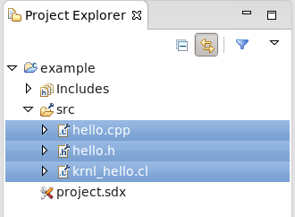

Executing SDx Examples in the 2016.3 SDx GUI
===============================================================================

All of the examples available in the SDx GitHub repository can be compiled by using either the provided Makefiles or the SDx GUI. Documentation on how to Makefile compilation is included in the README file of each example. This document outlines the steps to run an example application in the SDx GUI.

The steps described in this document use the hello example application as a reference. These steps apply to all example applications in the repository.

### Create the Hello Application Example Project in the GUI
- Open the SDx GUI by running the following command in the terminal window
```
    sdx
```
- Create a new project for the example design. This will open the *New Project Wizard*

- In the *Templates* page, select **Empty Application**


- In the new project, right-click on the **src** folder, and select **Import...** to start the file import Wizard

- In the *Import* wizard, select **General > File Systems** and click **Next**


- Browse to the *src* directory for the *hello example design*

- Select all of the source files and click **Finish**


- The *Project Explorer* should look like



- The example applications use a common infrastructure for host code APIs and support libraries. To complete the setup of the *hello application* in the SDx GUI, you will need to add the infrastructure files to the project.  The common infrastucture files are located in the *repository-directory/libs/xcl* . The files needed by this example are
    - xcl.c
    - xcl.h

- Right-click on the *src* folder and select **Import...**

- In the **Import Dialog**, select **General > File System** and click **Next**

- Browse to the *repository-directory/libs/xcl*

- Select the *xcl.c* and *xcl.h* files and click **Finish**


- Select the project in the **Project Explorer**

- Edit the project properties by **Right-click > Properties** or **File > Properties**

- Select **C/C++ Build > Settings**


- In the **Configuration** menu, select *[All Configurations]*

- In the **Tool Settings** tab, select **SDx GCC Compiler (x86_64) > Includes**

- In the **Include paths (-I)**, click **Add**


- In the **Project Settings** window, click **Add HW Function...***

- Select *krnl_hello* and click **OK**. This will add the accelerator function for the *hello example* to the project


### Configuring the Build Environment

Once the project has been setup, the build configuration has to be updated to compile the project.

- Open the **Run Configuration** panel


- Click the **Environment** tab

- Add the following environment variables

Environment Variable | Value | Comments
---------------------|-------|----------
XCL_TARGET|*${config_name:${project_name}}* |The *${project_name}* value is translated by the GUI to refer to the location of the current active workspace.This parameter can also be set explicitly as part of the configuration. For instance, in the *hello example* the explicit setting of the variable would be *\${config_name:hello}*
XCL_BINDIR|..|The runtime directory is one directory below the build directory; ".." is the build directory

- Rename the build configurations as follows

Default Name | New Name
-------------|---------
Emulation-CPU|sw_emu
Emulation-HW|hw_emu
System|hw
