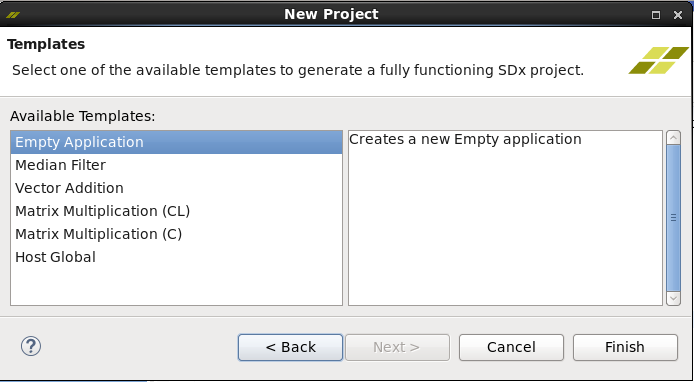
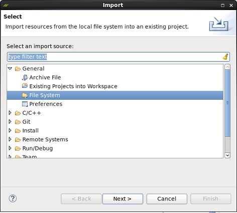
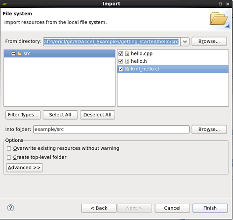
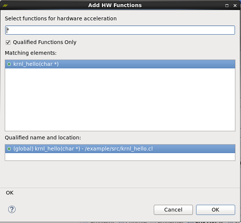

Executing SDx Examples in the 2016.3 SDx GUI
===============================================================================

All of the examples available in the SDx GitHub repository can be compiled by using either the provided Makefiles or the SDx GUI. Documentation on how to Makefile compilation is included in the README file of each example. This document outlines the steps to run an example application in the SDx GUI.

The steps described in this document use the hello example application as a reference. These steps apply to all example applications in the repository.

### Configure the design to be compiled by the GUI
- Change directory into the example of choice. For these instructions, the hello example is used. It is assumed the example repository has been cloned into a directory called *example*
```
    cd example/getting_started/basic/hello
```
- Execute the following command
```
    make local-files
```

### Create the Hello Application Example Project in the GUI
- Open the SDx GUI by running the following command in the terminal window
```
    sdx
```
- Create a new project for the example design. This will open the *New Project Wizard*

- In the *Templates* page, select **Empty Application**



- In the new project, right-click on the **src** folder, and select **Import...** to start the file import Wizard

- In the *Import* wizard, select **General > File Systems** and click **Next**



- Browse to the *src* directory for the *hello example design*

- Select all of the source files and click **Finish**



- In the **Project Settings** window, click **Add HW Function...***

- Select *krnl_hello* and click **OK**. This will add the accelerator function for the *hello example* to the project



- Build and run the application
