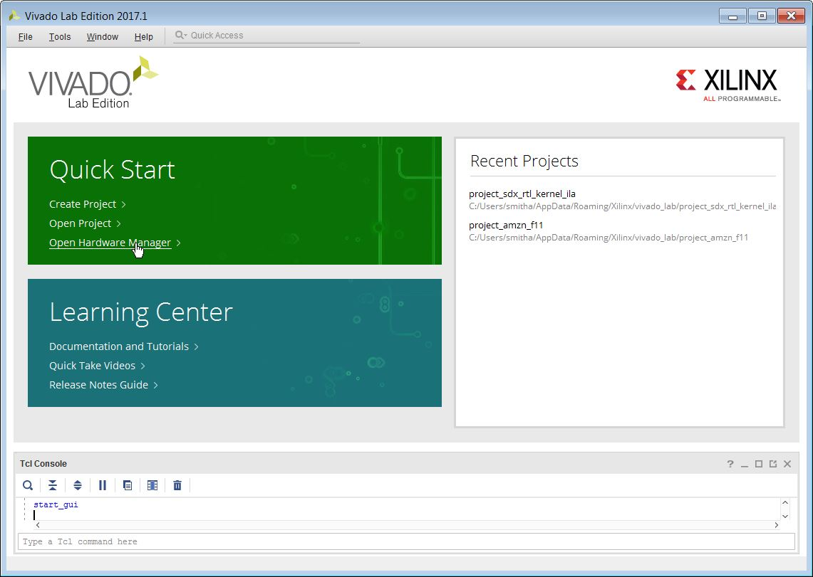
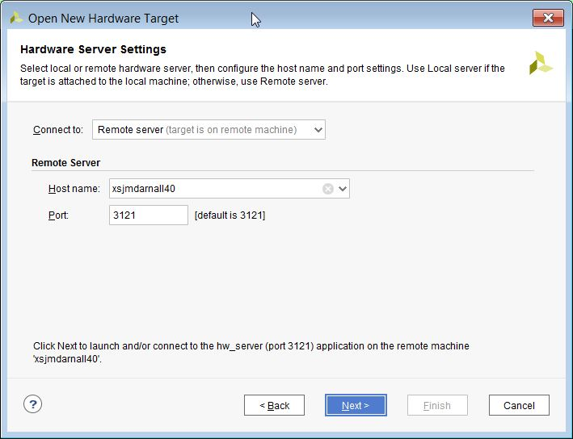
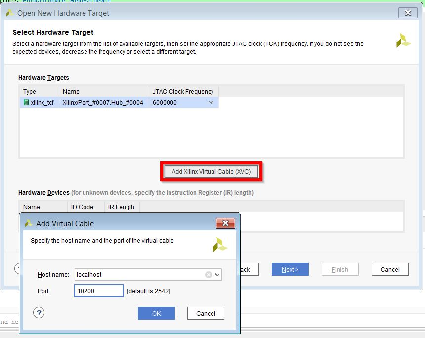
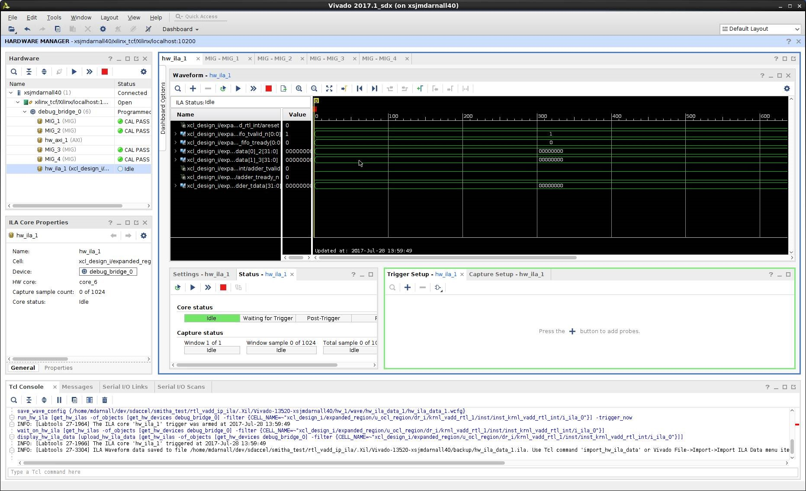

Vector Addition With RTL Kernel (RTL)
======================

This README file contains the following sections:

1. OVERVIEW
2. HOW TO DOWLOAD THE REPOSITORY
3. SOFTWARE TOOLS AND SYSTEM REQUIREMENTS
4. DESIGN FILE HIERARCHY
5. COMPILATION AND EXECUTION
6. EXECUTION IN CLOUD ENVIRONMENTS
7. DEBUG OF DESIGN IN HARDWARE
7. SUPPORT
8. LICENSE AND CONTRIBUTING TO THE REPOSITORY
9. ACKNOWLEDGEMENTS
10. REVISION HISTORY


## 1. OVERVIEW
Simple example of Debugging Vector Addition using RTL Kernel in Hardware

***KEY CONCEPTS:*** Hardware Debug of RTL Kernel

## 2. HOW TO DOWNLOAD THE REPOSITORY
To get a local copy of the SDAccel example repository, clone this repository to the local system with the following command:
```
git clone https://github.com/Xilinx/SDAccel_Examples examples
```
where examples is the name of the directory where the repository will be stored on the local system.This command needs to be executed only once to retrieve the latest version of all SDAccel examples. The only required software is a local installation of git.

## 3. SOFTWARE AND SYSTEM REQUIREMENTS
Board | Device Name | Software Version
------|-------------|-----------------
Alpha Data ADM-PCIE-7V3|xilinx:adm-pcie-7v3:1ddr|SDAccel 2017.1
Xilinx VU9P|xilinx:xil-accel-rd-vu9p:4ddr-xpr|SDAccel 2017.1
AWS VU9P F1|xilinx:aws-vu9p-f1:4ddr-xpr-2pr|SDAccel 2017.1
Xilinx KU115|xilinx:xil-accel-rd-ku115:4ddr-xpr|SDAccel 2017.1
Alpha Data ADM-PCIE-KU3|xilinx:adm-pcie-ku3:2ddr-xpr|SDAccel 2017.1


*NOTE:* The board/device used for compilation can be changed by adding the DEVICES variable to the make command as shown below
```
make DEVICES=<device name>
```
where the *DEVICES* variable accepts either 1 device from the table above or a comma separated list of device names.

## 4. DESIGN FILE HIERARCHY
Application code is located in the src directory. Accelerator binary files will be compiled to the xclbin directory. The xclbin directory is required by the Makefile and its contents will be filled during compilation. A listing of all the files in this example is shown below

```
.gitignore
Makefile
README.md
description.json
scripts/gen_xo.tcl
scripts/package_kernel.tcl
src/hdl/krnl_vadd_rtl.v
src/hdl/krnl_vadd_rtl_adder.sv
src/hdl/krnl_vadd_rtl_axi_read_master.sv
src/hdl/krnl_vadd_rtl_axi_write_master.sv
src/hdl/krnl_vadd_rtl_control_s_axi.v
src/hdl/krnl_vadd_rtl_counter.sv
src/hdl/krnl_vadd_rtl_int.sv
src/host.cpp
src/kernel.xml
```

## 5. COMPILATION AND EXECUTION
### Compiling for Application Emulation
As part of the capabilities available to an application developer, SDAccel includes environments to test the correctness of an application at both a software functional level and a hardware emulated level.
These modes, which are named sw_emu and hw_emu, allow the developer to profile and evaluate the performance of a design before compiling for board execution.
It is recommended that all applications are executed in at least the sw_emu mode before being compiled and executed on an FPGA board.
```
make TARGETS=<sw_emu|hw_emu> all
```
where
```
	sw_emu = software emulation
	hw_emu = hardware emulation
```
*NOTE:* The software emulation flow is a functional correctness check only. It does not estimate the performance of the application in hardware.
The hardware emulation flow is a cycle accurate simulation of the hardware generated for the application. As such, it is expected for this simulation to take a long time.
It is recommended that for this example the user skips running hardware emulation or modifies the example to work on a reduced data set.
### Executing Emulated Application 
***Recommended Execution Flow for Example Applications in Emulation*** 

The makefile for the application can directly executed the application with the following command:
```
make TARGETS=<sw_emu|hw_emu> check

```
where
```
	sw_emu = software emulation
	hw_emu = hardware emulation
```
If the application has not been previously compiled, the check makefile rule will compile and execute the application in the emulation mode selected by the user.

***Alternative Execution Flow for Example Applications in Emulation*** 

An emulated application can also be executed directly from the command line without using the check makefile rule as long as the user environment has been properly configured.
To manually configure the environment to run the application, set the following
```
export LD_LIBRARY_PATH=$XILINX_SDX/runtime/lib/x86_64/:$LD_LIBRARY_PATH
export XCL_EMULATION_MODE=<sw_emu|hw_emu>
emconfigutil --xdevice 'xilinx:xil-accel-rd-ku115:4ddr-xpr' --nd 1
```
Once the environment has been configured, the application can be executed by
```
./host
```
This is the same command executed by the check makefile rule
### Compiling for Application Execution in the FPGA Accelerator Card
The command to compile the application for execution on the FPGA acceleration board is
```
make all
```
The default target for the makefile is to compile for hardware. Therefore, setting the TARGETS option is not required.
*NOTE:* Compilation for application execution in hardware generates custom logic to implement the functionality of the kernels in an application.
It is typical for hardware compile times to range from 30 minutes to a couple of hours.

## 6. Execution in Cloud Environments
FPGA acceleration boards have been deployed to the cloud. For information on how to execute the example within a specific cloud, take a look at the following guides.
* [AWS F1 Application Execution on Xilinx Virtex UltraScale Devices] (Coming Soon)
* [Nimbix Application Execution on Xilinx Kintex UltraScale Devices]
* [IBM SuperVessel Research Cloud on Xilinx Virtex Devices]

## 7. DEBUG OF DESIGN IN HARDWARE

The Xilinx SDx FPGA platforms supports Xilinx Virtual Cable(XVC) protocol capability, by emulating JTAG over PCIe.

To take advantage of this capability, SDx enables running the XVC Server. The XVC Server is an implementation of Xilinx Virtual Cable (XVC) protocol, which allows (local or remote) Vivado to connect to a target FPGA for debug leveraging standard Xilinx standard debug cores like Integrated Logic Analyzer - ILA, Virtual Input/Output - VIO, and others.

Traditionally, a physical JTAG connection is used to debug FPGAs. SDx platforms have leveraged Xilinx XVC, for a debug flow that enables debug in the cloud.

There are two main design modifications which enable XVC debug:

###Instantiating Debug cores in the RTL Kernel

Customers need to instantiate debug cores like Integrated Logic Analyzer - ILA, Virtual Input/Output - VIO, and others in their application RTL kernel code.
This design has an ILA Debug core is instantiated in the following Application source file
	src/hdl/krnl_vadd_rtl_int.sv
The ILA monitors the output of the combinatorial adder.

		// ILA monitoring combinatorial adder
		ila_0 i_ila_0 (
			.clk(ap_clk),              // input wire        clk
			.probe0(areset),           // input wire [0:0]  probe0  
			.probe1(rd_fifo_tvalid_n), // input wire [0:0]  probe1 
			.probe2(rd_fifo_tready),   // input wire [0:0]  probe2 
			.probe3(rd_fifo_tdata),    // input wire [63:0] probe3 
			.probe4(adder_tvalid),     // input wire [0:0]  probe4 
			.probe5(adder_tready_n),   // input wire [0:0]  probe5 
			.probe6(adder_tdata)       // input wire [31:0] probe6
		);

###Host Code Changes to support debugging

The application host code also needs to be modified to ensure that the customer can set up the ILA trigger conditions after the application has been programmed into the device, but prior to actually running the kernel. 
Note line 74 of src/host.cpp
	 
		....
		```c_cpp		
		cl::Program::Binaries bins = xcl::import_binary_file(binaryFile);
		devices.resize(1);
		cl::Program program(context, devices, bins);
		cl::Kernel krnl_vadd(program,"krnl_vadd_rtl");
		
		wait_for_enter("\nPress ENTER to continue after setting up ILA trigger...");
		
		//Allocate Buffer in Global Memory
		....
		
		//Launch the Kernel
		q.enqueueTask(krnl_vadd);


###Start Debug Servers

#### Starting Debug Servers on Amazon F1 instance
Instructions to start the debug servers on an Amazon F1 instance can be found here: [https://github.com/aws/aws-fpga/blob/master/hdk/docs/Virtual_JTAG_XVC.md](https://github.com/aws/aws-fpga/blob/master/hdk/docs/Virtual_JTAG_XVC.md)

#### Starting Debug Servers on Nimbix and other cloud platforms
There are 3 steps required to build and start the debug servers prior to debugging the design in Vivado Hardware Manager.

Step 1: Build the XVC server 

	> $cd xvcserver/
	> $make

Step 2: Run the xvc_pcie driver
	
	>$bin/xvc_pcie -d /dev/xclmgmt0 

Step 3: Start the XVC server on port 10200 and the hw_server on port 3121

	>$hw_server -L- -ljtag2 -e "set auto-open-servers xilinx-xvc:localhost:10200" -e "set always-open-jtag 1" 


####Debugging design Using Vivado Hardware Manager

Vivado Hardware Manager (Vivado or Vivado Lab Edition) can be running on the target instance (i.e. the cloud itself) or it can be running remotely on a different host. The TCP port on which the XVC Server is listening must be accessible to the host running Vivado Hardware Manager.

To connect the Vivado Hardware Manager to XVC server on the target, the following steps should be followed on the machine hosting Vivado:

1. Launch Vivado Lab Edition (or full featured Vivado) 
  

2. Select “Open Hardware Manager”. 	

3. Connect to the target board           
 

4. Connect to the target instance Virtual JTAG XVC server 	
 

5. Select the debug bridge instance from the Vivado Hardware panel

6. In the Hardware Device Properties window select the appropriate “Probes file” for your design by clicking the icon next to the “Probes file” entry, selecting the file, and clicking “OK”. This will refresh the hardware device and it should now show the debug cores present in your design. Note the Probes file is written out during the design implementation, and is typically has the extension ".ltx".
7. Vivado Hardware Manager can now be used to debug the design

 


## 8. SUPPORT
For more information about SDAccel check the [SDAccel User Guides][]

For questions and to get help on this project or your own projects, visit the [SDAccel Forums][].

To execute this example using the SDAccel GUI, follow the setup instructions in [SDAccel GUI README][]


## 9. LICENSE AND CONTRIBUTING TO THE REPOSITORY
The source for this project is licensed under the [3-Clause BSD License][]

To contribute to this project, follow the guidelines in the [Repository Contribution README][]

## 10. ACKNOWLEDGEMENTS
This example is written by developers at
- [Xilinx](http://www.xilinx.com)

## 11. REVISION HISTORY
Date | README Version | Description
-----|----------------|------------
SEP2017|1.0|Initial Xilinx Release

[3-Clause BSD License]: ../../../LICENSE.txt
[SDAccel Forums]: https://forums.xilinx.com/t5/SDAccel/bd-p/SDx
[SDAccel User Guides]: http://www.xilinx.com/support/documentation-navigation/development-tools/software-development/sdaccel.html?resultsTablePreSelect=documenttype:SeeAll#documentation
[Nimbix Getting Started Guide]: http://www.xilinx.com/support/documentation/sw_manuals/xilinx2016_2/ug1240-sdaccel-nimbix-getting-started.pdf
[Walkthrough Video]: http://bcove.me/6pp0o482
[Nimbix Application Submission README]: ../../../utility/nimbix/README.md
[Repository Contribution README]: ../../../CONTRIBUTING.md
[SDaccel GUI README]: ../../../GUIREADME.md
[AWS F1 Application Execution on Xilinx Virtex UltraScale Devices]: ../../../README.md
[Nimbix Application Execution on Xilinx Kintex UltraScale Devices]: ../../../utility/nimbix/README.md
[IBM SuperVessel Research Cloud on Xilinx Virtex Devices]: http://bcove.me/6pp0o482
